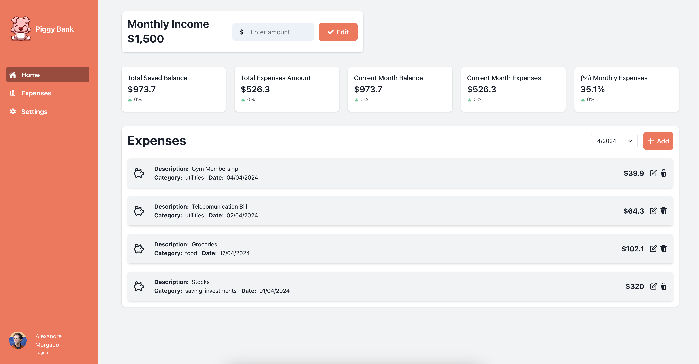

# Piggy Bank Web App

Piggy Bank is a single page app built with react, that allows users to add their own expenses and have an overall stats of those expenses.

## Description



This project was made with the purpose of learning and testing react framework. So this app is not connected to and external API or DB. All
Expenses and Stats will be lost if you reload the page.

By using Piggy Bank app you are able to check the following stats:

- Overall Saved Balance trought all months of expenses
- Overall Expenses Amount
- Current Month Balance
- Current Month Expenses
- Percentage of Current Month Expenses

## What was used in this Project

- React
- useState
- Chakra UI Library
- Vite
- Git

## Instalation

```bash
npm install
```

## Usage

```bash
npm run dev
```

## Contributing

Pull requests are welcome. For major changes, please open an issue first
to discuss what you would like to change.

Please make sure to update tests as appropriate.

## License

[MIT](https://choosealicense.com/licenses/mit/)
